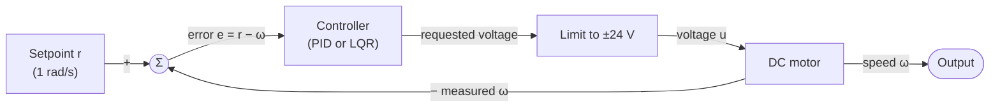
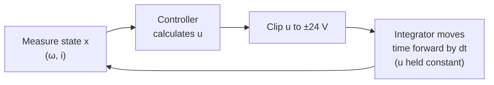
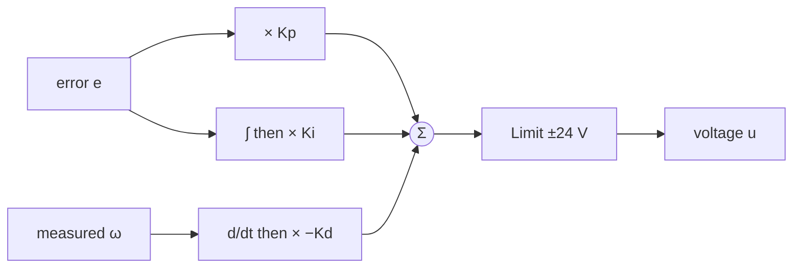
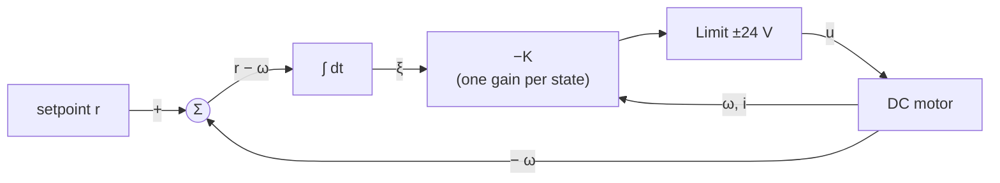

# Lessons Learned: PID vs. LQR Speed Control of a DC Motor

This is a from-the-ground-up explanation of everything in this project: the physics, the maths, the code, and the things that went wrong. It's written for a first-year engineering student, so it assumes you know basic algebra, what a derivative is, and how to multiply two matrices, and not much else.

Every number and plot here comes from the code in this repo. You can regenerate all the figures with `python docs/make_figures.py` (the circuit diagram also needs `pip install schemdraw`).

## Contents

1. [The problem](#1-the-problem)
2. [Modelling the motor](#2-modelling-the-motor)
3. [State space: writing the model as matrices](#3-state-space-writing-the-model-as-matrices)
4. [Simulation: how a computer moves time forward](#4-simulation-how-a-computer-moves-time-forward)
5. [PID control](#5-pid-control)
6. [LQR control](#6-lqr-control)
7. [PID vs. LQR: results](#7-pid-vs-lqr-results)
8. [What broke, and what I learned from it](#8-what-broke-and-what-i-learned-from-it)
9. [Glossary](#9-glossary)
10. [Further reading](#10-further-reading)

---

## 1. The problem

We have a DC motor. We can choose the **voltage** we apply to it (between −24 V and +24 V), and we want its shaft to spin at exactly **1 rad/s**, reaching that speed quickly without overshooting.

The obvious approach is to work out what voltage gives 1 rad/s and apply it. That's called **open-loop** control, and it has two problems:

- It's slow, because the motor takes its own sweet time to get there (you'll see this in section 2).
- It can't correct itself. If the load changes, the battery sags, or your model numbers are slightly off, the speed drifts and nothing notices.

The fix is **feedback** (closed-loop control). We measure the speed, compare it with what we want, and let a **controller** decide the voltage based on the difference:



This project compares two ways of designing that controller box: **PID**, the classic hand-tuned approach, and **LQR**, an optimal, maths-driven one.

---

## 2. Modelling the motor

Before we can control anything, we need equations that describe how the motor behaves. A DC motor is really two systems joined together: an **electrical circuit** and a **spinning mass**.


### 2.1 The electrical side

The motor's winding is a long coil of wire, which has both **resistance** R and **inductance** L. When the motor spins, it also acts as a generator and produces a voltage that pushes *against* the supply. That's called **back-EMF**, and it's proportional to speed: $`K_e \omega`$.

Kirchhoff's Voltage Law says the voltages around the loop must add up, so the supply voltage is shared between the three:

```math
V = \underbrace{R\,i}_{\text{resistor}} + \underbrace{L\,\frac{di}{dt}}_{\text{inductor}} + \underbrace{K_e\,\omega}_{\text{back-EMF}}
```

What each term means:

- **$`R\,i`$** is Ohm's law. More current means more voltage lost as heat in the wire.
- **$`L\,\frac{di}{dt}`$** is the inductor, which resists *changes* in current. It's like the inertia of the electricity: current can't jump instantly, it has to build up.
- **$`K_e\,\omega`$** is the back-EMF. The faster the motor spins, the more it fights the supply. This is why a motor draws a big current when starting and less once it's up to speed.

### 2.2 The mechanical side

Current flowing through the winding in the magnetic field produces a **torque** proportional to current: $`K_t\,i`$. Newton's second law for rotation (torque = inertia × angular acceleration) gives:

```math
J\,\frac{d\omega}{dt} = \underbrace{K_t\,i}_{\text{motor torque}} - \underbrace{b\,\omega}_{\text{friction}}
```

- **J** is the rotor's **moment of inertia**, how hard it is to speed up. It's the rotational version of mass.
- **$`b\,\omega`$** is **viscous friction**, a drag torque that grows with speed (bearings, air, and so on).

### 2.3 How the two sides are linked

The two equations are **coupled**: speed ω appears in the electrical equation (through back-EMF), and current i appears in the mechanical one (through torque). You can't solve one without the other.

$`K_t`$ and $`K_e`$ are the same number for an ideal motor in SI units. This comes from conservation of energy: the electrical power going in, $`K_e \omega \cdot i`$, must equal the mechanical power coming out, $`K_t i \cdot \omega`$.

### 2.4 Our numbers

| Symbol | Meaning | Value |
|---|---|---|
| J | Rotor inertia | 0.01 kg·m² |
| b | Viscous friction | 0.1 N·m·s |
| K_t | Torque constant | 0.01 N·m/A |
| K_e | Back-EMF constant | 0.01 V·s/rad |
| R | Resistance | 1 Ω |
| L | Inductance | 0.5 H |

These are the values from the well-known University of Michigan *Control Tutorials for MATLAB & Simulink* DC motor example. They're chosen for teaching rather than realism. In particular, L = 0.5 H is huge. A real small motor has an inductance in the millihenries, so its current responds in milliseconds rather than half a second.

### 2.5 Sanity check: the steady state

"Steady state" means everything has settled and nothing is changing, so every derivative is zero. Setting $`\frac{di}{dt} = 0`$ and $`\frac{d\omega}{dt} = 0`$:

```math
\text{Mechanical: } 0 = K_t i - b\omega \;\Rightarrow\; i = \frac{b\,\omega}{K_t}
```

```math
\text{Electrical: } V = R\,i + K_e\,\omega = \frac{R\,b\,\omega}{K_t} + K_e\,\omega
\;\Rightarrow\;
\omega = \frac{K_t}{R\,b + K_t K_e}\,V
```

Plugging in the numbers:

```math
\omega = \frac{0.01}{(1)(0.1) + (0.01)(0.01)}\,V = \frac{0.01}{0.1001}\,V \approx 0.0999\,V
```

So to spin at 1 rad/s, we need about **10 V**, and the current will be $`i = 0.1 \times 1 / 0.01 = `$ **10 A**. Both numbers show up again later: in section 5 and section 7 both controllers settle at exactly 10 V.

Here's what happens if we just apply 10 V and wait (open loop):


It gets there, but it takes about 2.5 seconds. The speed curve starts off flat (an S-shape) because the current has to build up through the inductor before any torque appears. The controllers in this project reach the target in about 0.4 s.

---

## 3. State space: writing the model as matrices

### 3.1 What is a "state"?

The **state** of a system is the smallest set of numbers that, together with the future inputs, lets you predict everything that happens next.

Think of a thrown ball. If you know its position and velocity right now, physics tells you its whole future path. You don't need to know how it got there. Position and velocity are its state.

For our motor, the state is **speed ω** and **current i**. If you know both right now, plus the voltage you'll apply, the two equations from section 2 tell you exactly what happens next. We stack them into a **state vector**:

```math
x = \begin{bmatrix} \omega \\ i \end{bmatrix}
```

### 3.2 Rearranging into matrix form

First, rearrange each equation so the derivative is alone on the left:

```math
\frac{d\omega}{dt} = -\frac{b}{J}\,\omega + \frac{K_t}{J}\,i
```

```math
\frac{di}{dt} = -\frac{K_e}{L}\,\omega - \frac{R}{L}\,i + \frac{1}{L}\,V
```

Both right-hand sides are just "some number × ω + some number × i + some number × V". That's exactly what a matrix multiplication produces, so we can write them together as:

```math
\underbrace{\begin{bmatrix} \dot\omega \\ \dot i \end{bmatrix}}_{\dot x}
=
\underbrace{\begin{bmatrix} -\frac{b}{J} & \frac{K_t}{J} \\[4pt] -\frac{K_e}{L} & -\frac{R}{L} \end{bmatrix}}_{A}
\underbrace{\begin{bmatrix} \omega \\ i \end{bmatrix}}_{x}
+
\underbrace{\begin{bmatrix} 0 \\[4pt] \frac{1}{L} \end{bmatrix}}_{B}
\underbrace{V}_{u}
```

(The dot over a letter, $`\dot x`$, is shorthand for $`\frac{dx}{dt}`$.)

This is the famous **state-space form**:

```math
\dot x = A\,x + B\,u \qquad y = C\,x
```

- **A** (the system matrix) describes how the states affect each other.
- **B** (the input matrix) describes how the input pushes on each state.
- **C** (the output matrix) picks out what we measure or care about. We want speed, so $`C = \begin{bmatrix} 1 & 0 \end{bmatrix}`$.

With our numbers:

```math
A = \begin{bmatrix} -10 & 1 \\ -0.02 & -2 \end{bmatrix}
\qquad
B = \begin{bmatrix} 0 \\ 2 \end{bmatrix}
\qquad
C = \begin{bmatrix} 1 & 0 \end{bmatrix}
```

To convince yourself the matrix form is the same as the original equations, multiply out the top row: $`\dot\omega = -10\,\omega + 1\,i + 0\,V`$. That's exactly $`-\frac{b}{J}\omega + \frac{K_t}{J} i`$ with the numbers substituted.

This is what `state_space()` in `src/motor_model.py` returns.

### 3.3 Poles: the system's natural speeds

The **eigenvalues** of A are called the system's **poles**. They tell you how the system behaves when left alone. You find them by solving $`\det(sI - A) = 0`$:

```math
\det\begin{bmatrix} s + 10 & -1 \\ 0.02 & s + 2 \end{bmatrix}
= (s+10)(s+2) - (-1)(0.02)
= s^2 + 12s + 20.02 = 0
```

Using the quadratic formula:

```math
s = \frac{-12 \pm \sqrt{144 - 80.08}}{2} = -6 \pm 3.9975
\quad\Rightarrow\quad
s_1 \approx -2.00,\;\; s_2 \approx -10.00
```

Each pole corresponds to a pattern of motion that behaves like $`e^{st}`$. How to read them:

| Pole | Behaviour | Why |
|---|---|---|
| Negative real number | Decays smoothly to zero | $`e^{-2t}`$ shrinks over time |
| Positive real number | Grows without limit (**unstable**) | $`e^{+2t}`$ explodes |
| Complex pair $`a \pm bj`$ | Oscillates while decaying (if a < 0) | The imaginary part makes sine waves |
| Further left | Faster | Bigger negative number, faster decay |

Each pole has a **time constant** τ = 1/|pole|, the time to get about 63% of the way to its final value. Our poles give τ = 0.1 s (fast, mostly mechanical) and τ = 0.5 s (slow, mostly electrical because of that huge inductance). A rule of thumb is that things settle in about 5τ, so 5 × 0.5 = 2.5 s, which is exactly what the open-loop plot showed.

**The whole point of a controller is to move these poles.** Feedback changes the effective A matrix, and so changes the poles. We want them further left (faster) without adding too much oscillation.

---

## 4. Simulation: how a computer moves time forward

A computer can't solve $`\dot x = Ax + Bu`$ continuously. Instead it takes small time steps of size dt (we use **dt = 0.001 s**, one millisecond) and estimates where the state will be after each one.

Each step of the simulation loop looks like this:



The voltage is held constant during each step, just as a real microcontroller holds its output between control updates. That's called a **zero-order hold**.

### 4.1 Euler's method: the simplest approach

The derivative tells you the slope right now. So assume the slope stays the same for the whole step:

```math
x_{k+1} = x_k + dt \cdot \dot x_k
```

Let's try the very first step by hand. The motor starts at rest, $`x_0 = [0,\; 0]`$, and we apply 10 V:

```math
\dot x_0 = A x_0 + B u = \begin{bmatrix} 0 \\ 0 \end{bmatrix} + \begin{bmatrix} 0 \\ 2 \end{bmatrix}(10) = \begin{bmatrix} 0 \\ 20 \end{bmatrix}
```

```math
x_1 = \begin{bmatrix} 0 \\ 0 \end{bmatrix} + 0.001 \begin{bmatrix} 0 \\ 20 \end{bmatrix} = \begin{bmatrix} 0 \\ 0.02 \end{bmatrix}
```

After one millisecond, the current is 0.02 A and the speed is still zero. That makes physical sense: the voltage pushes current first, and only then does current create torque.

### 4.2 Why Euler can go badly wrong

Euler works well with small steps, but it breaks down with big ones. For a pole λ, each Euler step multiplies that part of the motion by $`(1 + \lambda\,dt)`$. Our fast pole is −10. With dt = 0.19 s:

```math
1 + (-10)(0.19) = -0.9
```

A negative multiplier flips the sign at every step, so the simulation zigzags even though the real motor never does:


The rule is that Euler is only stable if $`|1 + \lambda\,dt| < 1`$, which for real poles means $`dt < 2/|\lambda|`$. Here that's dt < 0.2 s, and 0.19 s is right at the edge.

### 4.3 Runge–Kutta 4 (RK4): what the code uses

RK4 samples the slope **four times** within each step (at the start, twice in the middle, and at the end) and takes a weighted average with weights 1, 2, 2, 1:

```math
\begin{aligned}
k_1 &= f(x_k) \\
k_2 &= f\!\left(x_k + \tfrac{dt}{2}k_1\right) \\
k_3 &= f\!\left(x_k + \tfrac{dt}{2}k_2\right) \\
k_4 &= f(x_k + dt\,k_3) \\
x_{k+1} &= x_k + \tfrac{dt}{6}\,(k_1 + 2k_2 + 2k_3 + k_4)
\end{aligned}
```

Think of it as checking the road ahead several times before committing to a direction. In the plot above, RK4 with the same big step sits right on top of the true answer.

In our actual simulation, dt = 0.001 s gives $`|\lambda|\,dt = 0.01`$, far inside the safe zone, so both methods would be fine. RK4 is just more accurate for the same effort. See `rk4_step()` in `sim_pid.py`.

---

## 5. PID control

### 5.1 The three terms

PID stands for **Proportional, Integral, Derivative**. The controller computes the error $`e = r - \omega`$ (target minus actual) and adds up three terms:

```math
u(t) = \underbrace{K_p\,e(t)}_{\text{P: present}} + \underbrace{K_i \int_0^t e\,d\tau}_{\text{I: past}} + \underbrace{K_d\,\frac{de}{dt}}_{\text{D: future}}
```

A driving analogy helps. You want to cruise at exactly 100 km/h:

- **P (present):** "I'm 20 km/h too slow, so press the accelerator a lot. I'm 2 km/h too slow, so press a little." The push is proportional to how wrong you are right now.
- **I (past):** "I've been slightly too slow for a while now, so gradually press harder." It adds up the error over time, which lets it remove small persistent errors that P alone would never fix.
- **D (future):** "The speed is climbing fast, so ease off before I overshoot." It reacts to how quickly things are changing, which acts as a brake.

We use $`K_p = 100`$, $`K_i = 200`$, $`K_d = 10`$.



### 5.2 Why do we need I at all?

Take the I term away and look at the steady state. To hold 1 rad/s the motor needs 10 V (section 2.5). With P alone, $`u = K_p e`$, so the only way to produce voltage is to **have** an error. Solving for where it settles:

```math
\omega = 0.0999\,u = 0.0999\,K_p\,(1 - \omega)
\;\Rightarrow\;
\omega = \frac{0.0999\,K_p}{1 + 0.0999\,K_p}
```

With $`K_p = 100`$: $`\omega = 9.99 / 10.99 \approx 0.909`$ rad/s, a permanent **9% error**. Raising $`K_p`$ shrinks the error but never removes it, and huge gains cause other problems.

The integral fixes this. As long as any error remains, the integral keeps growing, and the voltage keeps rising until the error reaches exactly zero. At that point P and D are both zero, and **the I term alone supplies all 10 V**.

### 5.3 PID in code (the discrete version)

A computer can't integrate or differentiate continuously, so we approximate:

- **Integral** ≈ running sum: `integral += e * dt`
- **Derivative** ≈ difference between samples: `(now − before) / dt`

From `src/pid.py`:

```python
u_unsat = (self.kp * error
           + self.ki * (self.integral + error * self.dt)
           - self.kd * d_meas)
```

### 5.4 Two refinements in our PID

**Derivative on measurement, not on error.** When the setpoint is constant, $`\frac{de}{dt} = \frac{d(r - \omega)}{dt} = -\frac{d\omega}{dt}`$, so the two are the same thing. The difference shows up when the setpoint *jumps*. The error jumps instantly too, its derivative is enormous for one sample, and the D term fires a huge voltage spike called **derivative kick**. Using $`-\frac{d\omega}{dt}`$ avoids that, because the actual speed can't jump. That's why the code uses `- self.kd * d_meas`.

**Saturation.** The real supply is only 24 V, so the output is clipped: `u = min(max(u_unsat, u_min), u_max)`.

### 5.5 Watching the terms work


Here's what's happening:

1. **t = 0:** the error is 1, so the P term asks for 100 V. The limit clips that to 24 V (black line).
2. **0 to 0.2 s:** P shrinks as the speed rises. D goes negative, braking against the fast rise. The **I term stays at zero**, which is the anti-windup working (next section).
3. **After 0.2 s:** the total drops below 24 V, the integrator switches on, and I climbs.
4. **Steady state:** P and D fade to zero, and I settles at about **10 V**, exactly the value predicted in section 2.5.

### 5.6 Integrator windup

While the output is stuck at 24 V, the error is still large. A naive integrator keeps adding that error up, so it "winds up" to a huge value. When the speed finally reaches the target, the integrator is still full and keeps pushing, and the speed overshoots badly while the integrator slowly unwinds.

It's like continuing to shout "faster!" at someone who's already running flat out. When they finally catch up, you're still shouting, so they run past the finish line.

**Anti-windup** stops that. Our version is **conditional integration**: only integrate when the output isn't saturated.

```python
if u == u_unsat:
    self.integral += error * self.dt
```

Same gains, same limit, with and without it:


Without anti-windup the speed overshoots by **23%**. With it, the overshoot is **2.6%**.

---

## 6. LQR control

### 6.1 A different idea: state feedback

PID only looks at one number, the speed error. But we have access to the whole state (speed *and* current). **State feedback** uses all of it, giving each state its own gain:

```math
u = -K\,x = -\begin{bmatrix} k_1 & k_2 \end{bmatrix} \begin{bmatrix} \omega \\ i \end{bmatrix} = -k_1\,\omega - k_2\,i
```

Substitute that into $`\dot x = Ax + Bu`$:

```math
\dot x = Ax - BKx = (A - BK)\,x
```

The motor with its controller behaves like a new system with matrix **A − BK**. Its poles are the eigenvalues of A − BK, and by choosing K we choose where they go. That's the core of state-space control.

The question is **which K**. You could pick pole locations by hand (called pole placement), but it's hard to know what good locations are, and it's easy to ask for more voltage than you have. LQR answers the question differently.

### 6.2 The cost function: describing what "good" means

LQR stands for **Linear Quadratic Regulator**:

- **Linear**: the system model is linear ($`\dot x = Ax + Bu`$).
- **Quadratic**: the cost is built from squared terms.
- **Regulator**: it drives the state to zero.

Instead of choosing K directly, you describe what you care about with a **cost**, and LQR finds the K that makes that cost as small as possible:

```math
J = \int_0^\infty \left( x^T Q\, x + u^T R\, u \right) dt
```

It looks intimidating, but with a diagonal Q it's just a weighted sum of squares:

```math
x^T Q\, x
= \begin{bmatrix} \omega & i \end{bmatrix}
\begin{bmatrix} q_1 & 0 \\ 0 & q_2 \end{bmatrix}
\begin{bmatrix} \omega \\ i \end{bmatrix}
= q_1\,\omega^2 + q_2\,i^2
```

and $`u^T R\,u = r\,u^2`$ for our single input. So the cost is:

```math
J = \int_0^\infty \left( \underbrace{q_1\,\omega^2 + q_2\,i^2}_{\text{"how wrong am I?"}} + \underbrace{r\,u^2}_{\text{"how hard am I pushing?"}} \right) dt
```

- **Q** sets how much each state error hurts. Bigger means "fix this fast."
- **R** sets how much using voltage hurts. Bigger means "go easy on the effort."

Squaring makes big errors much more costly than small ones, and it treats positive and negative errors equally.

**Only the ratio of Q to R matters.** Multiply both by 100 and you get exactly the same K. (I checked: Q = diag(100, 0, 10000), R = 0.01 and Q = diag(10⁴, 0, 10⁶), R = 1 give identical gains.)

### 6.3 Worked example: LQR with one state, by hand

The matrix version needs a computer, but a one-state version can be solved on paper, and it shows everything important.

Take a system $`\dot x = a\,x + b\,u`$ with feedback $`u = -k\,x`$ and cost $`J = \int (q\,x^2 + r\,u^2)\,dt`$. The optimal gain comes from the **Riccati equation**, which for one state is just a quadratic in an unknown number p:

```math
2a\,p - \frac{b^2}{r}\,p^2 + q = 0
```

Taking the positive root (the one that gives a stable system):

```math
p = \frac{r}{b^2}\left(a + \sqrt{a^2 + \frac{b^2 q}{r}}\right)
\qquad
k = \frac{b\,p}{r} = \frac{a + \sqrt{a^2 + b^2 q / r}}{b}
```

The closed-loop pole is $`a - b\,k`$:

```math
\boxed{\;a - b\,k = -\sqrt{a^2 + b^2\,\frac{q}{r}}\;}
```

That's a beautiful result. Try it with $`a = -10`$, $`b = 1`$ (similar to our motor's mechanical pole):

| q / r | Gain k | Closed-loop pole | Meaning |
|---|---|---|---|
| 0 | 0 | −10 | Effort is "infinitely expensive", so do nothing |
| 300 | 10 | −20 | Twice as fast |
| 9900 | 90 | −100 | Ten times as fast |


Three lessons come out of this:

1. **The pole is always negative.** Whatever q/r you choose, the square root is positive, so LQR always gives a stable controller (as long as the system is controllable, see section 6.6).
2. **q/r is the speed knob.** More q/r means a faster response and more voltage.
3. **There are diminishing returns.** Because of the square root, going 10× faster needs about 100× more q/r, and so much more effort. That's the physics telling you speed isn't free.

### 6.4 The matrix version

For more than one state, the same idea becomes the **Continuous Algebraic Riccati Equation (CARE)**:

```math
A^T P + P A - P B R^{-1} B^T P + Q = 0
\qquad\Rightarrow\qquad
K = R^{-1} B^T P
```

Compare it with the one-state version: $`2ap`$ became $`A^TP + PA`$, $`\frac{b^2}{r}p^2`$ became $`PBR^{-1}B^TP`$, and $`k = \frac{bp}{r}`$ became $`K = R^{-1}B^TP`$. It's the same equation in matrix clothing.

**P** has a nice meaning: if the system starts at state x, the smallest possible total cost from there onwards is $`x^T P\,x`$. It's a "cost-to-go" map.

Nobody solves this by hand for real systems. `scipy.linalg.solve_continuous_are` does it. From `src/lqr.py`:

```python
P = solve_continuous_are(A, B, Q, R)
return np.linalg.solve(R, B.T @ P)   # K = R⁻¹ Bᵀ P
```

`np.linalg.solve(R, M)` computes $`R^{-1}M`$ without explicitly inverting R, which is numerically safer.

### 6.5 Adding integral action

**The problem:** plain LQR is a *regulator*. It drives the state to **zero**. We want speed to go to 1 rad/s, and to hold that speed the motor needs a steady 10 V. With $`u = -Kx`$ alone, the controller has no reliable way to produce exactly the right steady voltage, so we'd get a steady-state error. That's the same problem P-only control had in section 5.2.

**The fix:** add a third state, the integral of the speed error, just as the I in PID:

```math
\xi = \int (r - \omega)\,dt \qquad\Rightarrow\qquad \dot\xi = r - \omega
```

The new **augmented** state is $`z = [\omega,\; i,\; \xi]^T`$, and the augmented model is:

```math
\begin{bmatrix} \dot\omega \\ \dot i \\ \dot\xi \end{bmatrix}
=
\underbrace{\begin{bmatrix} A & 0 \\ -C & 0 \end{bmatrix}}_{A_{aug}}
\begin{bmatrix} \omega \\ i \\ \xi \end{bmatrix}
+
\underbrace{\begin{bmatrix} B \\ 0 \end{bmatrix}}_{B_{aug}} u
\;+\;
\begin{bmatrix} 0 \\ 0 \\ 1 \end{bmatrix} r
```

With our numbers:

```math
A_{aug} = \begin{bmatrix} -10 & 1 & 0 \\ -0.02 & -2 & 0 \\ -1 & 0 & 0 \end{bmatrix}
\qquad
B_{aug} = \begin{bmatrix} 0 \\ 2 \\ 0 \end{bmatrix}
```

The bottom row, $`[-1,\; 0,\; 0]`$, is the "$`-\omega`$" part of $`\dot\xi = r - \omega`$. The setpoint r is a constant, so it doesn't affect the gain calculation. It's added inside the controller instead (`self.xi += (setpoint - x[0]) * self.dt`). That's what `augment_with_integrator()` builds.

**Why this guarantees zero error:** if the closed loop is stable, everything eventually stops changing, so $`\dot\xi = 0`$. But $`\dot\xi = r - \omega`$, so **ω = r exactly**. No tuning required, since the structure itself forces it.

The full controller:



```math
u = -K z = -k_\omega\,\omega - k_i\,i - k_\xi\,\xi
```

### 6.6 Controllability: can we steer every state?

Before solving for K, check that the input can actually influence every state. If some state can't be moved by u, no controller can place its pole. The test is to build the **controllability matrix** and check it has full rank (for a square matrix, a non-zero determinant):

```math
\mathcal{C} = \begin{bmatrix} B & AB & A^2B \end{bmatrix}
```

Working it out for the augmented system:

```math
B = \begin{bmatrix} 0 \\ 2 \\ 0 \end{bmatrix}
\quad
AB = \begin{bmatrix} 2 \\ -4 \\ 0 \end{bmatrix}
\quad
A^2B = A(AB) = \begin{bmatrix} -24 \\ 7.96 \\ -2 \end{bmatrix}
```

```math
\mathcal{C} = \begin{bmatrix} 0 & 2 & -24 \\ 2 & -4 & 7.96 \\ 0 & 0 & -2 \end{bmatrix}
\qquad
\det(\mathcal{C}) = 8 \neq 0 \;\checkmark
```

Each column shows how far the input's influence has spread:

- **B:** voltage pushes only on **current** directly.
- **AB:** one step later, current has pushed on **speed**.
- **A²B:** one more step, speed has pushed on the **integral state**.

Voltage → current → speed → integral is an unbroken chain, so every state can be reached. That's what `is_controllable()` checks.

### 6.7 Reading the gain

With the starting weights, `check_lqr.py` prints:

```
K = [[ 0.108  0.053 -1.   ]]
```

The integral gain is **negative**, which confused me at first. When the motor is too slow, ξ grows positive. Since $`u = -K z`$, a negative $`k_\xi`$ turns that into $`u = -(-1)\,\xi = +\xi`$, positive voltage, which speeds the motor up. The minus sign in $`u = -Kz`$ and the minus sign in the gain cancel out.

Something I noticed: in every tuning I tried, $`k_\xi = -\sqrt{q_\xi / r}`$ exactly ($`-\sqrt{1/1} = -1`$, $`-\sqrt{5000/0.01} \approx -707`$, $`-\sqrt{10000/0.01} = -1000`$). It's the same square-root pattern as the one-state example.

### 6.8 Tuning Q and R

Q is 3×3, one weight per augmented state: `Q = diag([speed, current, integral])`. The current weight stays at **0**, because we don't care what the current is as long as the speed is right.

| Q (speed, current, integral) | R | K | Closed-loop poles | Rise time | Overshoot |
|---|---|---|---|---|---|
| 1, 0, 1 | 1 | [0.11, 0.05, −1] | −10.0, −2.01, **−0.1** | never reaches 90% | 0% |
| 100, 0, 5000 | 0.01 | [82.2, 8.1, −707] | −7.28, −10.48 ± 9.18j | 0.448 s | 0% |
| 10, 0, 5000 | 0.01 | [60.4, 6.8, −707] | −12.53, −6.57 ± 8.35j | 0.386 s | 3.0% |
| **100, 0, 10000** | **0.01** | **[100.0, 9.0, −1000]** | **−10.0, −10.05 ± 9.95j** | **0.399 s** | **0%** |


Reading the pole map:

- **First tuning (blue circles):** the controller barely changed anything. Two poles sit on top of the open-loop ones (the black crosses), and the new integral pole is at −0.1, right next to the unstable boundary. A pole at −0.1 means a time constant of 10 seconds, which is why the blue curve crawls. It's a great example of a pole map predicting the response before you even run a simulation.
- **Lowering R to 0.01** makes voltage 100× cheaper, so all the poles move well to the left.
- **Complex pairs** (points above and below the axis) add some oscillation. How much depends on the **damping ratio** $`\zeta = |\text{real}| / |\text{pole}|`$. The green pair has ζ ≈ 0.62, and that response overshoots by 3%. The red pair (final tuning) has ζ ≈ 0.71, a classic well-damped choice, and shows no visible overshoot.
- **Lowering the speed weight** from 100 to 10 (orange → green) moved the complex pair towards the imaginary axis, meaning less damping and more overshoot.

### 6.9 The catch: LQR needs the whole state

LQR's formula uses the **current** as well as the speed. In simulation that's free, since we just read `x[1]`. On real hardware you'd need either:

- a **current sensor** (such as a shunt resistor with an amplifier), or
- an **observer** (for example a Kalman filter): a software copy of the motor model that estimates the current from the voltage you applied and the speed you measured.

PID only needs the speed measurement. That's a real practical trade-off, and part of why PID is still everywhere.

---

## 7. PID vs. LQR: results


| Controller | Rise time (to 90%) | Overshoot | Steady voltage | Measurements needed |
|---|---|---|---|---|
| PID (Kp=100, Ki=200, Kd=10) | 0.404 s | 2.6% | 10 V | Speed |
| LQR (Q=diag(100,0,10000), R=0.01) | 0.399 s | 0.0% | 10 V | Speed and current |

Both controllers spend the first ~0.2 s at the 24 V limit, which is the physical bottleneck here. Both settle at 10 V, as predicted in section 2.5.

An honest comparison:

| | PID | LQR |
|---|---|---|
| Tuning | Trial and error with three gains that interact | Choose what you care about (Q, R), and the maths finds the gains |
| Guarantees | None built in | Stable by construction, if the model is right and the system is controllable |
| Needs a model? | No, and it can be tuned on the real system | Yes, and the gains are only as good as A and B |
| Sensors | Just the output | The full state (or an observer) |
| Scales to many inputs and outputs? | Awkward | Naturally |

**Neither is "better."** For this simple motor, a well-tuned PID and LQR end up very similar. LQR with an integrator is essentially a PI controller on speed plus extra feedback from the current. LQR's real strengths show up on systems with many coupled states, like balancing robots or drones, where hand-tuning a pile of PID loops gets messy.

---

## 8. What broke, and what I learned from it

### 8.1 The LQR voltage chatters at the limit

Zoom in on the LQR voltage while it's saturated and it isn't flat. It flickers rapidly (the blue line):


**Why it happens.** I logged the unsaturated command step by step, and it alternated like this:

| Step | Unsaturated command | Applied | Integrator |
|---|---|---|---|
| 33 | 24.32 V | 24 V (clipped) | frozen |
| 34 | 23.82 V | 23.82 V | runs |
| 35 | 24.32 V | 24 V (clipped) | frozen |
| 36 | 23.81 V | 23.81 V | runs |

Two effects fight each other every millisecond:

1. **While frozen,** the current and speed keep rising, and their gains pull the command **down** by about 0.5 V per step.
2. **When the integrator runs,** it adds $`|k_\xi| \times e \times dt \approx 1000 \times 1 \times 0.001 = `$ about **1 V** in a single step, pushing the command back **above** 24 V.

Conditional integration is an on/off switch, and the LQR command hovers right at the switching point, so the switch flips every step. The PID doesn't suffer from this because its unsaturated command sits far above 24 V for most of that period (the P term alone starts at 100 V, see section 5.5), so it isn't hovering at the edge.

**Why it matters.** On real hardware, chatter means a noisy PWM signal, extra heat in the driver, and often an audible whine.

**A fix: back-calculation anti-windup.** Instead of switching the integrator fully on or off, bleed it off gradually in proportion to how far over the limit the command is:

```math
\dot\xi = (r - \omega) + K_{aw}\,(u - u_{unsat})
```

When not saturated, $`u = u_{unsat}`$, so the extra term vanishes and it's a normal integrator. When saturated high, $`u - u_{unsat}`$ is negative, which smoothly reduces ξ (and with our negative $`k_\xi`$, that lowers the command). The orange line in the plot uses $`K_{aw} = 1`$, and the chatter is gone.

**Next step:** add back-calculation as an option in the `LQR` class and compare all three anti-windup approaches.

### 8.2 `TypeError: only 0-dimensional arrays can be converted to Python scalars`

`K` is a 1×3 matrix, so `K @ z` returns an **array containing one number**, not a plain number, and recent NumPy versions refuse to convert that with `float()`. The fix was `float(-self.K[0] @ z)`, which takes the first row (a plain 1-D array) before multiplying, so the result is a single number.

The lesson is that matrix shapes matter. When something odd happens, `print(thing.shape)` is the first thing to check.

### 8.3 Tooling lessons (being honest here)

| Problem | Cause | Fix |
|---|---|---|
| `SyntaxError` on `python sim_compare.py` | I was inside Python's interactive mode (`>>>` prompt) | `exit()`, then run it from the normal terminal (`$` prompt) |
| `ModuleNotFoundError: No module named 'numpy'` | The virtual environment wasn't active in the new terminal | `source .venv/Scripts/activate`, then check `(.venv)` in the prompt |
| `No such file or directory` | The new file was created inside `src/` by mistake | Moved it to the project root, next to `sim_pid.py` |
| `git push` rejected (`fetch first`) | The GitHub repo wasn't empty when I first pushed | `git push --force` once, for a brand-new repo only |

---

## 9. Glossary

| Term | Meaning |
|---|---|
| **Anti-windup** | Any method that stops an integrator growing while the output is saturated |
| **Back-EMF** | The voltage a spinning motor generates, which opposes the supply |
| **Closed loop** | Control that uses measurements of the output (feedback) |
| **Controllability** | Whether the input can steer every state of the system |
| **Damping ratio (ζ)** | How oscillatory a pair of complex poles is. 1 means no oscillation, 0 means it never stops oscillating |
| **Derivative kick** | A voltage spike from the D term when the setpoint jumps |
| **Eigenvalue** | A special number of a matrix. For A, these are the poles |
| **Gain** | A multiplier inside a controller |
| **Observer** | Software that estimates unmeasured states from a model and the available measurements |
| **Open loop** | Control without feedback |
| **Overshoot** | How far past the target the output goes, as a percentage |
| **Pole** | A value describing a natural mode of the system. Its position shows speed and stability |
| **Riccati equation** | The matrix equation solved to find the LQR gain |
| **Rise time** | Time to reach 90% of the target (the definition used here) |
| **Saturation** | Hitting a physical limit, here the ±24 V supply |
| **State** | The minimum set of numbers that describes the system right now |
| **Steady state** | When everything has settled and nothing is changing |
| **Time constant (τ)** | Time to cover about 63% of a change, equal to 1/\|pole\| |
| **Zero-order hold** | Holding the output constant between controller updates |

---

## 10. Further reading

- **University of Michigan, *Control Tutorials for MATLAB & Simulink*:** the DC Motor Speed example that these parameter values come from, with worked PID and state-space designs.
- **Brian Douglas, *Control System Lectures* and the MATLAB *Tech Talks* series (YouTube):** excellent visual explanations of PID, state space, and LQR.
- **Karl Johan Åström and Richard M. Murray, *Feedback Systems: An Introduction for Scientists and Engineers*:** a thorough textbook, which the authors make freely available online.
