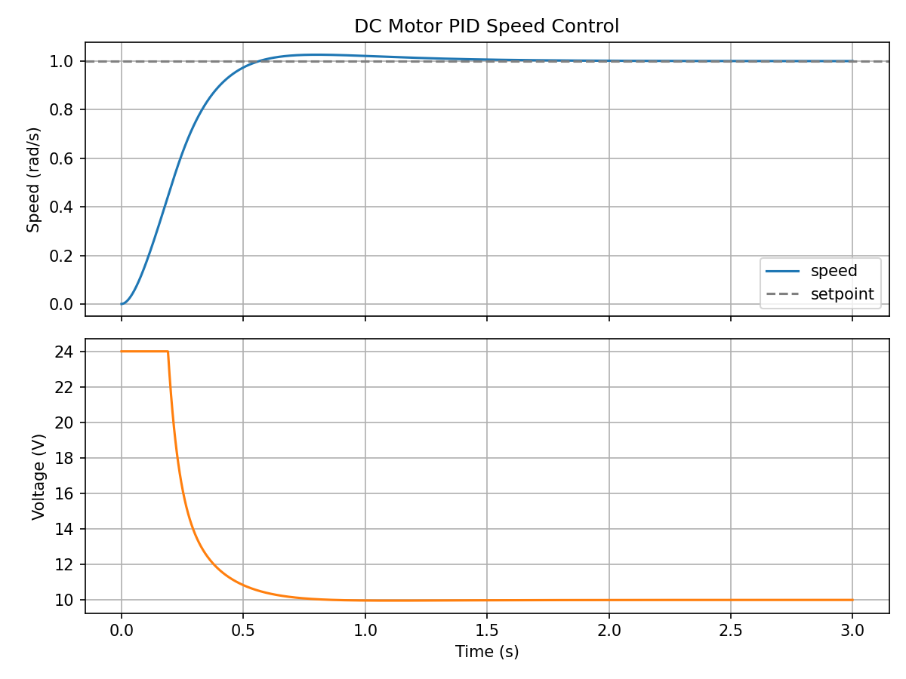
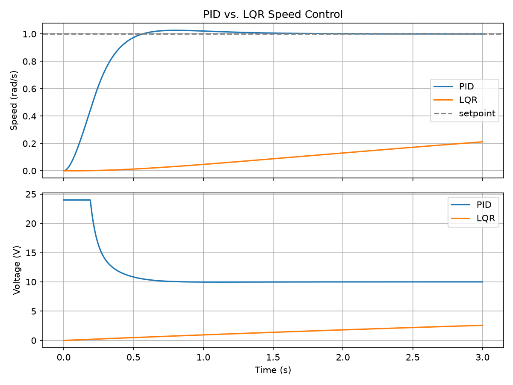

# DC Motor Control: PID vs. LQR

Speed control of a brushed DC motor, comparing a classical PID controller with an LQR state-feedback controller. First in simulation (Python), then ported to C++.



## Goals
- [x] Model a DC motor (electrical + mechanical dynamics)
- [x] Discrete PID with saturation and anti-windup
- [x] LQR controller with integral action
- [x] PID vs. LQR comparison (rise time, overshoot, control effort)
- [ ] Add measurement noise and a load disturbance
- [ ] Port controllers to C++

## Run it
```bash
python -m venv .venv
source .venv/bin/activate        # Windows: .venv\Scripts\activate
pip install -r requirements.txt
python sim_pid.py
```

## Project structure
```
src/motor_model.py   # motor dynamics + state-space matrices
src/pid.py           # discrete PID controller
sim_pid.py           # closed-loop simulation and plotting
results/             # saved plots
```

## Notes & lessons learned

   A full from-scratch explanation of the maths, the code, and what broke is in
   [docs/LESSONS_LEARNED.md](docs/LESSONS_LEARNED.md).
